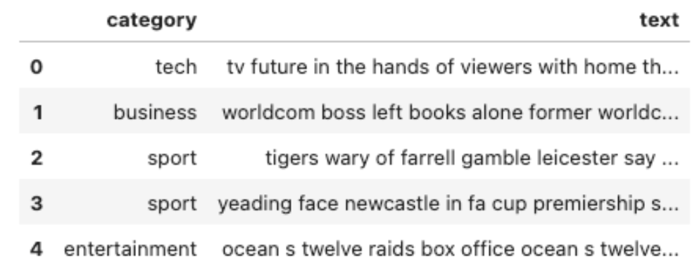
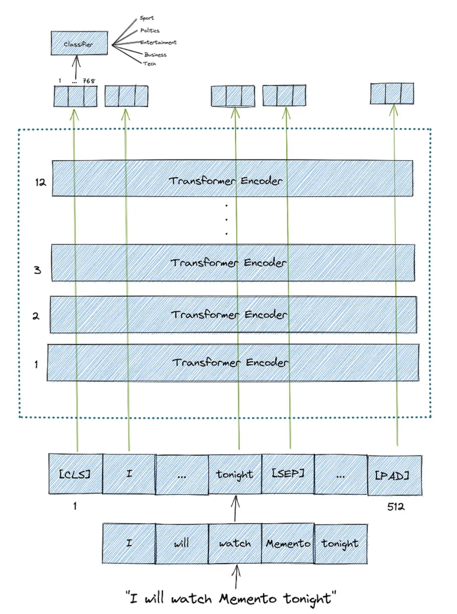
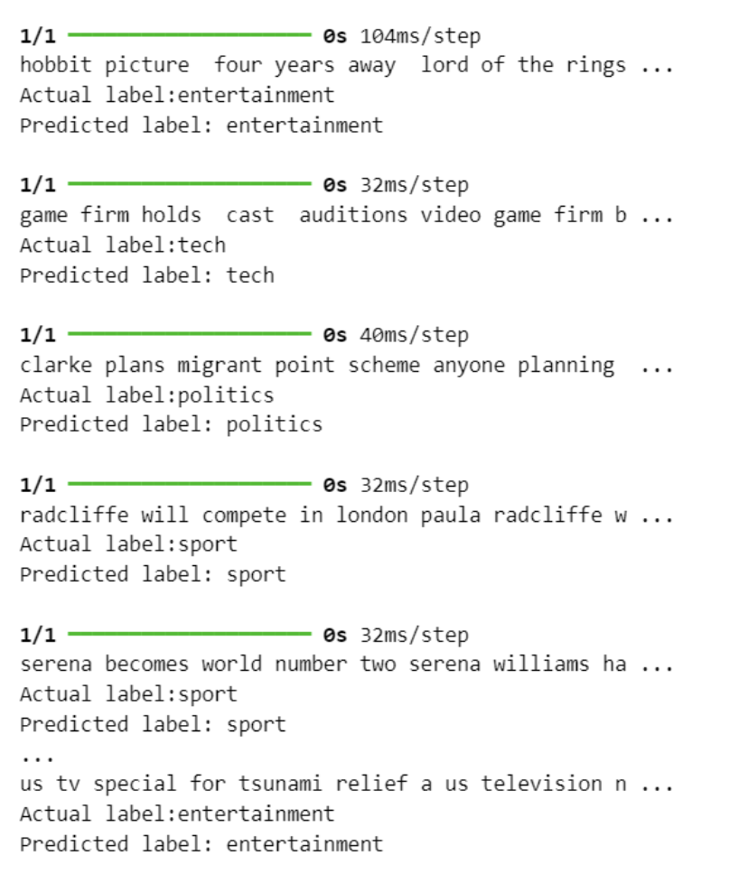
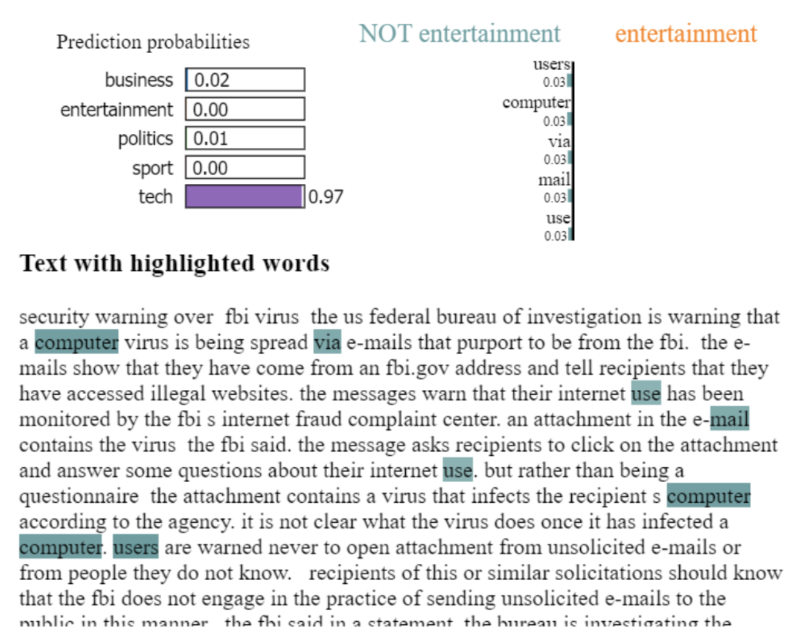
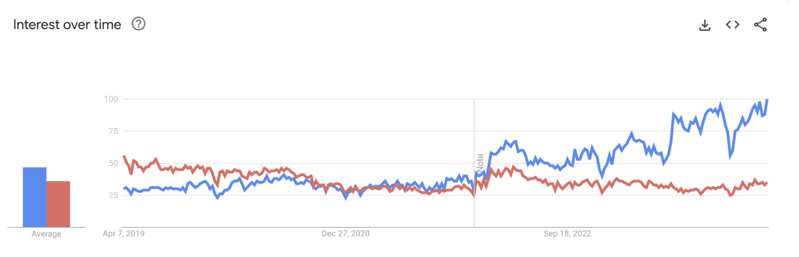

# cgi-capstone

This is a transcription of the project poster that my team and I submitted for our Capstone Project at the University of Pittsburgh.

For this project, we signed an NDA with CGI, and so I can't share any of the code that we used. We produced a nice poster that I thought would make an excellent demonstration of the work that we did, so I've taken the liberty of transcribing the poster into markdown format below.

## Project Goals
1. Build, train, and test two text classification models built in PyTorch and Tensorflow, respectively.
2. Compare these two frameworks and develop a decision matrix to help CGI understand where and when they might use PyTorch or Tensorflow in the future.

## Tools and Setup
In this project, we worked with AWS, specifically Amazon Sagemaker, as a cloud solution for running our trained models. We worked primarily with Python, using tools like numpy and pandas for data manipulation. Our code was hosted in a shared GitHub repository. Most of our code was written in Jupyter Notebooks for added clarity.

We were provided a large dataset of news articles to use as a training set, and a holdout test set to make predictions on our data and evaluate the performance. We were tasked with distinguishing between five possible categories:

- Tech
- Business
- Sports
- Entertainment
- Politics

A sample of the larger dataset can be seen below:

## Model Development and Training with Bert
For many of us in the group, this was the first time we’d worked with these frameworks, so the model development and training processes were carefully laid out in the form of several milestones across the semester to help us ease into the work.

We built both models using a pre-trained BERT (**B**idirectional **E**ncoder **R**epresentations from **T**ransformers) model. This simplified the model building process and allowed us to control for any differences between the two frameworks.

BERT uses the same transformer technology first published by Google in their 2017 paper *Attention Is All You Need*. This is also the **T** in ChatGP**T**. BERT was developed by Google in 2018, and we used a trained model provided by Hugging Face. The graph above shows the process of “tokenizing” the input into bite-sized pieces, pumping them through transformers, and then classifying the overall input.

Both models were built with BERT as a basis. New Jupyter notebooks were created as endpoints for accessing and serializing both models.

## API and Explainability with LIME

In the next phase of our research, we created a set of APIs using Python’s FastAPI library, and implemented LIME (Local Interpretable Model-Agnostic Explanations) to better explain what the models are doing under the surface. 

The APIs allowed us to quickly make predictions with each of the models individually, giving us an idea about how they performed in a real-world setting on new inputs. Each API takes a POST request with a data query that the user sends, and based on the input, will return a prediction using the models we trained. The API was dockerized and deployed in an ECS cluster in AWS.

> an example of predictions being made -- not the API interface

LIME gave us access to a more robust understanding about what specific words were being used by the model to make decisions about to classify the inputs. This can be seen in the image below, along with an interface that more closely resembles the one we used in our API:

## PyTorch vs Tensorflow

The major goal of our project was to take these frameworks and provide CGI with a comprehensive explanation about when to use each framework. We stumbled upon some major points of consideration in our personal exploration for both frameworks:

### Tensorflow:
- Smaller file size and training times in model development
- Faster predictions
- Longer history of standard use and scalability in industry use
- Integrated better with LIME

### PyTorch:
- Longer training times and larger files
- Had some difficulty integrating LIME as described by the sponsors
- More “Pythonic” in style; easier for longtime Python programmers to pick up

Ultimately, though, both of these models had a similarly high level of accuracy and both are being used in production environments. The general consensus upon further research is that PyTorch is currently in vogue and picking up steam in academic environments. It seems to be more easily customizable if you’re building non-standard, custom machine learning models.

This google trends graph does a good job of showing how interest in PyTorch has eclipsed Tensorflow in recent years. 

Both frameworks are perfectly capable of achieving the same levels of performance, and it will come down to a matter of preference for CGI’s development team and hiring priorities. 

Using PyTorch will certainly keep CGI at the bleeding edge and allow them to hire on experienced developers in a technology that appears to be gaining the edge. 

If they’re working with lots of existing Tensorflow code that’s being scaled in quite large ways, and their development team is already working with this framework, there isn’t a major reason to switch over to PyTorch at the moment, as skills between the frameworks translate with some adjustment.

## Acknowledgements
BERT Graph taken from:
https://towardsdatascience.com/text-classification-with-bert-in-pytorch-887965e5820f

[1] Link to the paper Attention is All You Need published by Google in 2017: https://proceedings.neurips.cc/paper_files/paper/2017/file/3f5ee243547dee91fbd053c1c4a845aa-Paper.pdf
